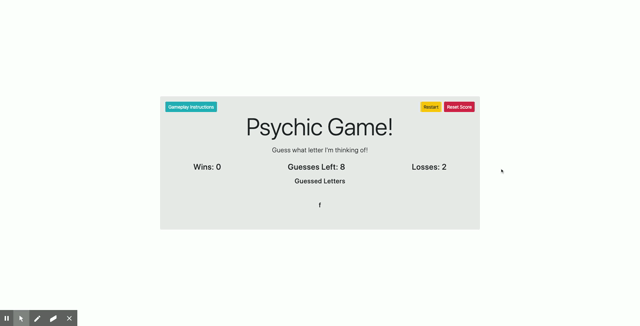

# Psychic-Game

## Overview

Create a guessing-style game that will run in the browser and dynamically update for the user.

## Details

Using JavaScript, create a psycic game that takes in the users request and compares it with a randomly chosen, and hidden, computer letter. Show the guessed letters to the user and notify them once the correct letter has been guessed.

## Instructions

Begin guessing by using the keyboard to enter your guessed letter. Each guessed letter will display until all guesses have been used or you matched the computers guess. 

## Languages/Topics Used

- HTML
- CSS
- JavaScript

## Link

https://aancjr.github.io/Psychic-Game/

## Preview

